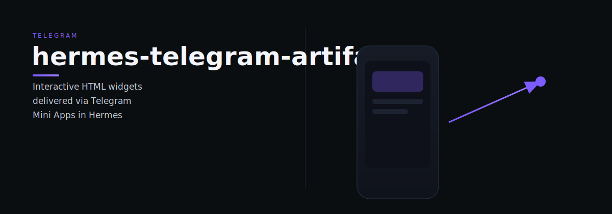

# hermes-telegram-artifacts

hermes-telegram-artifacts — Standalone artifact server + skill for delivering interactive HTML widgets via Telegram Mini Apps in Hermes Agent

> Tell it what you need. It does the work.

## Quick start

bash

## What it does

1. **Serves artifact HTML** via a tiny Python HTTP server (stdlib only, no pip)
2. **Sends artifacts to Telegram** as web_app buttons that open as Mini Apps
3. **Gallery page** — browse, open, and delete previous artifacts without digging through chat history (/artifacts/all)
4. **localStorage persistence** — artifacts can store state (checked shopping lists, preferences, form data) that survives closing Telegram. Just note: localStorage is device-local, so a list checked off on your phone won't reflect on your desktop

> Note: The artifact server (artifact-server.py) is stdlib-only. send-artifact.py requires python-telegram-bot, python-dotenv, and requests.

## Dependencies

bash
pip install python-telegram-bot python-dotenv requests

---

*hermes-telegram-artifacts is part of the [OCAS Agent Suite](https://github.com/indigokarasu).*