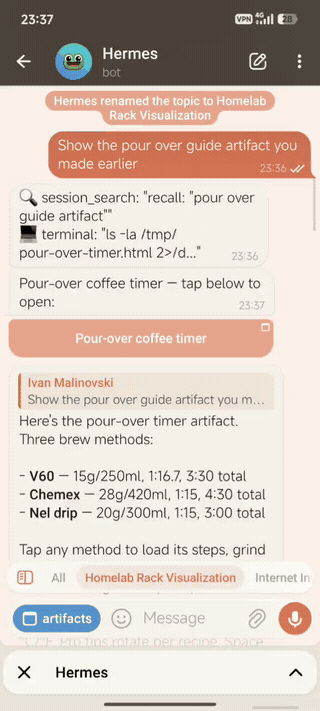

# Hermes Telegram Artifacts

> **Built with [Xiaomi MiMo 2.5](https://huggingface.co/Xiaomi/MiMo-7B-RL).** If you run [Hermes Agent](https://github.com/NousResearch/hermes-agent), give your agent this repo link — it will handle the install and configuration. The only manual step is enabling the Mini App via @BotFather.

A standalone toolkit for serving and delivering interactive HTML artifacts through Telegram bots. Works with [Hermes Agent](https://github.com/NousResearch/hermes-agent) or any Telegram bot that supports Mini Apps.

## Inspiration

Inspired by Claude's artifact panel — that inline sandbox where you can build, preview, and iterate on interactive content in one view. Telegram doesn't support inline HTML rendering, but it does support **Mini Apps**: full web pages that open from a button in chat. So that's the approach here. Hermes generates an HTML artifact, and Telegram shows a **Open** button right in the conversation. Tap it, and the artifact slides up as a Mini App panel.

## What It Does

1. **Serves artifact HTML** via a tiny Python HTTP server (stdlib only, no pip)
2. **Sends artifacts to Telegram** as `web_app` buttons that open as Mini Apps
3. **Gallery page** — browse, open, and delete previous artifacts without digging through chat history (`/artifacts/all`)
4. **localStorage persistence** — artifacts can store state (checked shopping lists, preferences, form data) that survives closing Telegram. Just note: localStorage is device-local, so a list checked off on your phone won't reflect on your desktop

## Demo



## Requirements

- Python 3.10+
- A Telegram bot with Mini Apps enabled (via @BotFather)
- HTTPS endpoint for your artifact server (Telegram requires HTTPS for Mini Apps)

## Quick Start

```bash
# 1. Start the artifact server
python3 scripts/artifact-server.py &

# 2. Register and send an artifact
python3 scripts/send-artifact.py /tmp/my-page.html "Open Dashboard" your-domain.com <chat_id> <thread_id>
```

That's it. The user sees a button in chat that opens the artifact as a Telegram Mini App.

## Architecture

```
Agent writes HTML → artifact-server.py (port 9877) → stored on disk
                                            ↓
send-artifact.py → Bot API web_app button → https://your-host/artifact/<id>
                                            ↓
                                User taps → Mini App panel slides up
```

The artifact server is a stateless HTTP server. It stores HTML files in `~/.hermes/artifacts/` and serves them on request. No database, no auth, no complexity.

## Installation

### 1. Clone or copy the scripts

```bash
git clone https://github.com/camel-vibe/hermes-telegram-artifacts.git
cd hermes-telegram-artifacts
```

Or just copy the `scripts/` directory somewhere.

### 2. Install dependencies

```bash
pip install python-telegram-bot python-dotenv requests
```

### 3. Set up your Telegram bot

1. Talk to **@BotFather** on Telegram
2. Create a new bot or use your existing Hermes bot
3. Run `/newapp` → set the Mini App URL to your public HTTPS endpoint
4. Optionally add a description and demo screenshots via BotFather

> **Important:** Telegram requires HTTPS for Mini Apps. If your server is only on HTTP, you need a reverse proxy (nginx, caddy, Tailscale Serve, etc.)

### 4. Configure environment

Your bot token should be in `~/.hermes/.env`:

```bash
TELEGRAM_BOT_TOKEN=123456:ABC-DEF...
HERMES_DASHBOARD_HOST=your-domain.com
```

The scripts auto-load this file via `python-dotenv`.

### 5. Start the server

```bash
python3 scripts/artifact-server.py
```

For production, run behind a reverse proxy with HTTPS:

```bash
# systemd service example
[Unit]
Description=Hermes Artifact Server
After=network.target

[Service]
Type=simple
ExecStart=/usr/bin/python3 /path/to/scripts/artifact-server.py
Restart=always
RestartSec=5

[Install]
WantedBy=multi-user.target
```

### 6. Set up HTTPS (required for Mini Apps)

**nginx:**
```nginx
server {
    listen 443 ssl;
    server_name your-domain.com;

    ssl_certificate /etc/letsencrypt/live/your-domain.com/fullchain.pem;
    ssl_certificate_key /etc/letsencrypt/live/your-domain.com/privkey.pem;

    location / {
        proxy_pass http://127.0.0.1:9877;
        proxy_set_header Host $host;
    }
}
```

**caddy:**
```
your-domain.com {
    reverse_proxy localhost:9877
}
```

**Tailscale Serve:**
```bash
tailscale serve --bg 9877
# Then: https://your-machine.tail-net.ts.net/
```
> **Note:** `tailscale serve` is tailnet-only (not publicly accessible). If you need public access for Telegram Mini Apps, use a reverse proxy or Tailscale Funnel instead.

## Scripts

### artifact-server.py

Stateless HTTP server. Stores HTML in `~/.hermes/artifacts/`.

```bash
python3 scripts/artifact-server.py [--port 9877] [--host 127.0.0.1]
```

**Routes:**
- `POST /artifact` — register new artifact (JSON: `{"title": "...", "html": "..."}`)
- `GET /artifact/<id>` — serve artifact HTML
- `GET /artifact/latest` — serve the most recent artifact
- `GET /artifacts` — JSON list: `[{"id": "...", "title": "...", "age": "..."}, ...]`
- `GET /artifacts/all` — gallery page (HTML): latest expanded, rest collapsed, Open/Delete buttons
- `GET /artifacts/latest-age` — age in seconds of the latest artifact
- `DELETE /artifact/<id>` — delete an artifact

### send-artifact.py

One-shot: register + send. The primary delivery script.

```bash
# From file — pass host, chat_id, thread_id explicitly:
python3 scripts/send-artifact.py /tmp/page.html "Title" your-domain.com <chat_id> <thread_id>

# Or use env var fallbacks for chat_id/thread_id:
python3 scripts/send-artifact.py /tmp/page.html "Title" your-domain.com
```

**Arguments:**

| Arg | Required | Description |
|-----|----------|-------------|
| html_path | yes | Path to HTML file, or `-` for stdin |
| title | yes | Button text (e.g., "Open Recipe") |
| host | yes | Your public hostname (or set `HERMES_DASHBOARD_HOST`) |
| chat_id | no | Telegram chat ID (or set `HERMES_ARTIFACT_CHAT`) |
| thread_id | no | Telegram thread/topic ID (or set `HERMES_ARTIFACT_THREAD`) |

**Env vars (read from `~/.hermes/.env`):**
- `TELEGRAM_BOT_TOKEN` — bot token (auto-loaded)
- `HERMES_DASHBOARD_HOST` — public hostname (used if host arg omitted)
- `HERMES_ARTIFACT_CHAT` — default chat_id
- `HERMES_ARTIFACT_THREAD` — default thread_id

### deliver-artifact.py

Minimal: save HTML to artifacts directory. No API calls.

```bash
python3 scripts/deliver-artifact.py <artifact_id> <html_file>
python3 scripts/deliver-artifact.py <artifact_id> -          # stdin
```

### register-artifact.py

Register HTML without sending. Useful for testing.

```bash
python3 scripts/register-artifact.py /tmp/page.html "Title"
```

### generate-artifact.py

Generate a starter artifact from the template.

```bash
python3 scripts/generate-artifact.py "My Artifact" > /tmp/artifact.html
```

## API

### POST /artifact

Register a new artifact.

**Request:**
```json
{"title": "My Page", "html": "<html>...</html>"}
```

**Response:**
```json
{"id": "a1b2c3d4e5f6", "title": "My Page", "type": "html", "timestamp": "..."}
```

### GET /artifact/<id>

Returns the artifact HTML with `Content-Type: text/html`.

### GET /artifacts

Returns JSON list of all artifacts with age info.

### GET /artifacts/all

Returns an HTML gallery page with all artifacts.

## Integration with Hermes

If you're running Hermes Agent, the Telegram adapter handles artifact delivery automatically:

1. Agent generates HTML content
2. Adapter registers it with the artifact server
3. Adapter sends a `web_app` button to the user's chat
4. User taps the button → artifact opens as a Mini App

The `HERMES_ARTIFACT_CHAT` and `HERMES_ARTIFACT_THREAD` env vars let you set default delivery targets.

## Pitfalls

- **HTTPS is mandatory.** Telegram will not open Mini Apps over plain HTTP (except from localhost for testing)
- **The artifact server must be accessible from Telegram's servers.** If you're behind a firewall, use a reverse proxy or Tailscale Serve
- **`web_app` buttons require Mini Apps to be enabled** in BotFather. Go to @BotFather → `/newapp` or set the menu button
- **Don't embed large assets inline.** Keep HTML under 100KB for fast loading. Use external CDN links for libraries (Chart.js, D3, etc.)
- **CORS:** The artifact server sets permissive CORS headers by default. If you restrict them, ensure Telegram's Mini App sandbox can fetch the HTML
- **Always pass `chat_id` and `thread_id` explicitly when possible.** The env var bridge (`HERMES_SESSION_THREAD_ID`) is unreliable with concurrent DM topics — `set_current_session_id()` writes to process-global `os.environ` and concurrent sessions clobber each other.
- **Tailscale Serve 502 after restart is transient.** The Serve proxy returns 502 while the backend warms up. Wait 2-3 seconds and retry.

## License

MIT
